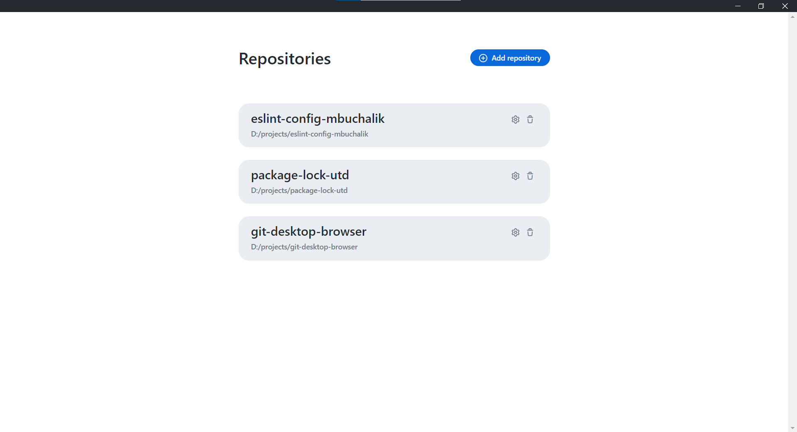
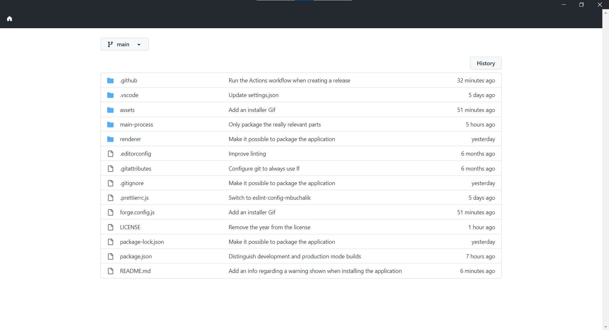
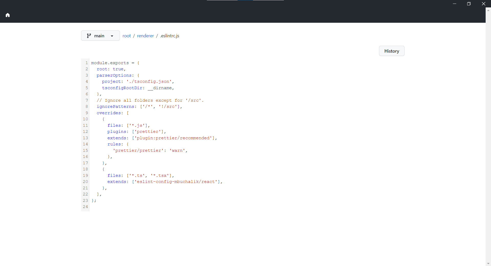
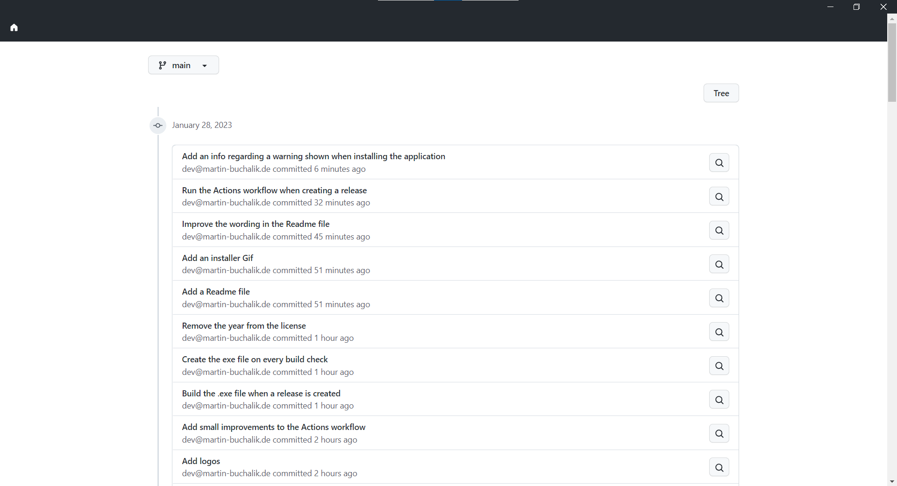
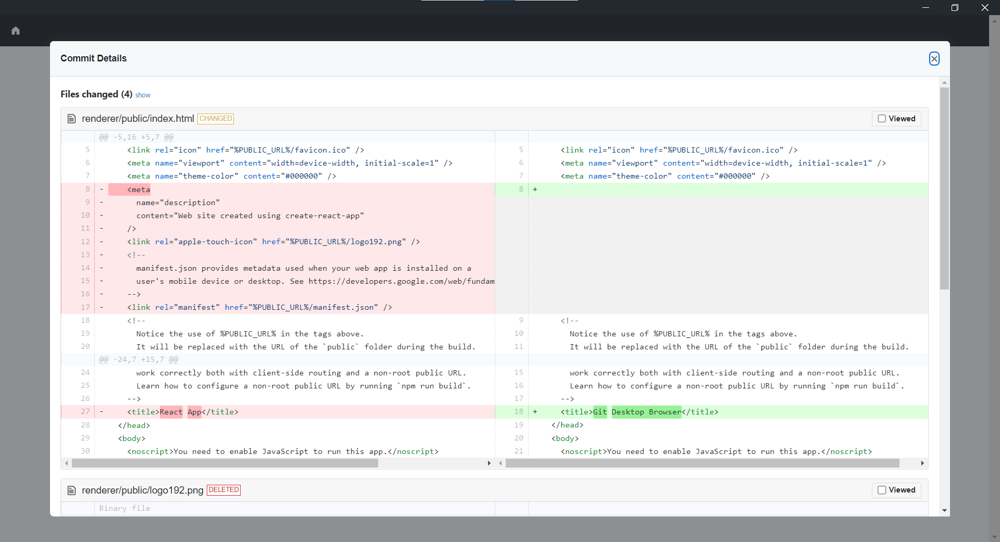

  

# Git Desktop Browser

> Browse Git repositories on your local machine.

Do you frequently use the GitHub or GitLab UI to explore the commit history of your repositories, to search for a particular branch, or to find the one file you created at a commit you made two weeks ago? Wouldn't it be awesome if you could explore these repositories on your local machine instead of having to rely on a web service?

There are many graphical and CLI applications for Git that enable to to **write** to a local Git repository. However, most of these applications do not have good **reading** capabilities: They make it very easy to create a new commit, but exploring the changes made in a particular commit is not in their scope.

`Git Desktop Browser` is a desktop application that fills this gap: `Git Desktop Browser` allows you to explore Git repositories on your local machine. The UI should be familiar to you from web UIs of your favorite Git hosting service 😉

`Git Desktop Browser` does not allow you to **write** to your repositories - there are many applications out there that already do this job very well. The focus here is really the **reading** part.

## Installing

Currently, `Git Desktop Browser` is only available for Windows.

To install the application, simply download the latest release `.exe` file from the [releases page](https://github.com/MBuchalik/git-desktop-browser/releases/latest) and run it.

Please note the following:

- When running the installer, Windows might say that the file is coming from an unknown source and is thus dangerous. This is because we currently do not code-sign the application and because the application is not installed on many computers. Once more people have installed it on their machines, the message should disappear.
- We do not have an auto-update mechanism yet, so please check out the releases page from time to time.

## Screenshots

